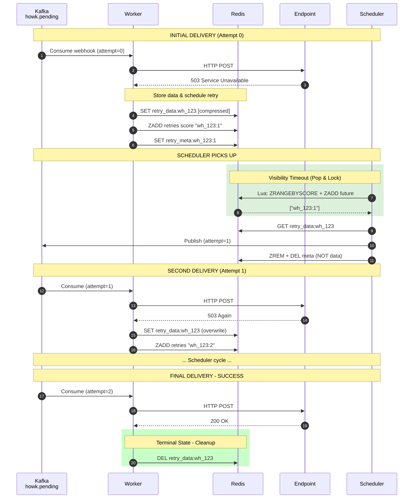
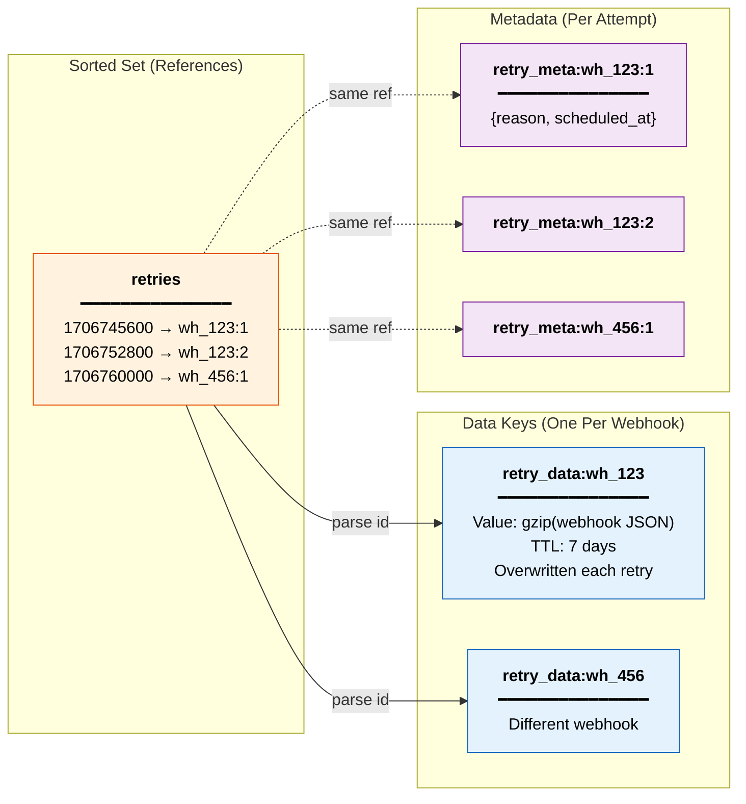
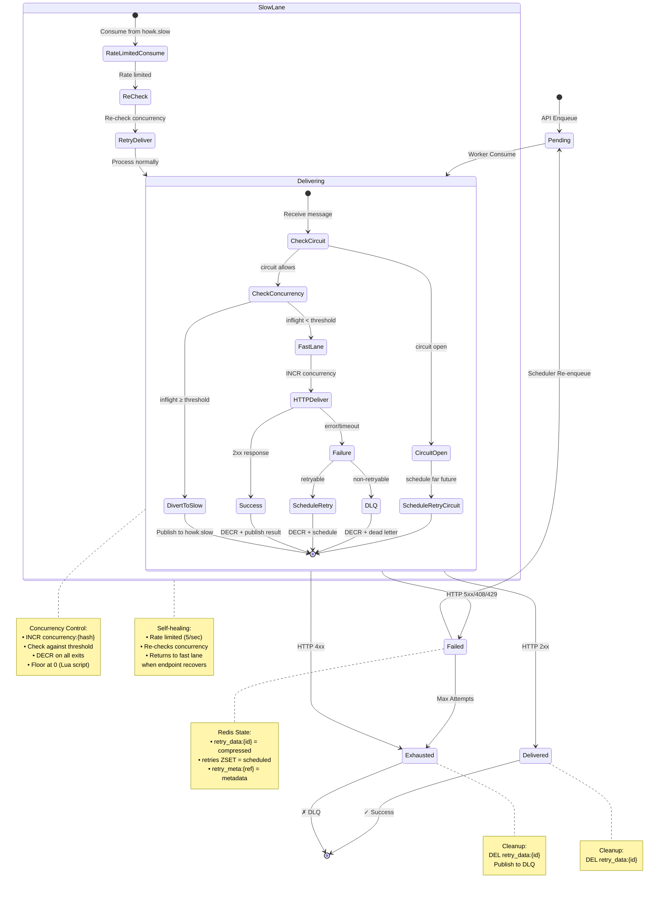

[](https://codecov.io/gh/renatocron/howk)

# HOWK - High Opinionated Webhook Kit

A high-throughput, fault-tolerant webhook delivery system built on Kafka + Redis.

## Philosophy

- **Kafka is the source of truth** — every webhook and delivery result is a Kafka record
- **Redis is rebuildable hot state** — if Redis dies, replay from Kafka
- **Circuit breakers protect endpoints** — failing endpoints don't burn your retry budget
- **Penalty box isolates slow endpoints** — excess in-flight traffic is rate-limited to protect the fast lane
- **At-least-once delivery** — we never lose a webhook, duplicates are the receiver's problem

## Architecture

### High-Level Overview

```
                    ┌─────────────────────────────────────┐
                    │           API Gateway               │
                    │  POST /webhooks/:config/enqueue     │
                    │  validate → batch produce           │
                    │  → 202 Accepted                     │
                    └───────────────┬─────────────────────┘
                                    │
                          Kafka Produce (batched)
                                    │
                                    ▼
                 ┌──────────────────────────────────────────┐
                 │            Kafka Cluster                 │
                 │                                          │
                 │  howk.pending    → webhooks to deliver   │
                 │  howk.slow       → rate-limited lane     │
                 │  howk.results    → delivery outcomes     │
                 │  howk.deadletter → exhausted retries     │
                 │                                          │
                 │  retention: 7 days                       │
                 └────┬─────────────────────────┬──────────┘
                      │                         │
            ┌─────────┘                         └──────────┐
            ▼                                              ▼
  ┌──────────────────────┐                    ┌───────────────────────┐
  │   Worker Pool        │                    │   Results Consumer    │
  │   (N consumers)      │                    │                       │
  │                      │                    │   • Update Redis      │
  │   • Read pending     │                    │     status/stats      │
  │   • Check circuit    │                    │   • Feed ClickHouse   │
  │   • Fire HTTP        │                    │     (optional)        │
  │   • Produce result   │                    │                       │
  │   • Schedule retry   │                    └───────────────────────┘
  │     if needed        │
  └──────────┬───────────┘
             │
             ▼
  ┌──────────────────────────────────────────────────────────────────┐
  │                           Redis                                   │
  │                                                                   │
  │  Circuit Breaker (per endpoint):                                  │
  │    HSET circuit:{endpoint_hash} state=OPEN failures=5 last=...   │
  │                                                                   │
  │  Concurrency Control (Penalty Box):                               │
  │    INCR concurrency:{endpoint_hash}  (with TTL)                  │
  │    Lua: DECR with floor at 0 to prevent drift                     │
  │                                                                   │
  │  Retry Scheduling:                                                │
  │    ZADD retries <next_at_unix> <webhook_id:attempt>              │
  │    SET retry_data:{id} <compressed_webhook>                      │
  │                                                                   │
  │  Status (per webhook):                                            │
  │    HSET status:{webhook_id} state=delivered attempt=1 ...        │
  │                                                                   │
  │  Stats (hourly buckets):                                          │
  │    INCR stats:delivered:2026013015                               │
  │    PFADD stats:hll:endpoints:2026013015 {endpoint}               │
  │                                                                   │
  │  ══════════════════════════════════════════════════════════════  │
  │  ALL OF THIS IS REBUILDABLE FROM KAFKA REPLAY                    │
  └──────────────────────────────────────────────────────────────────┘
```

### System Data Flow

```mermaid
flowchart TB
    subgraph Kafka["Kafka Topics"]
        PENDING[("howk.pending")]
        SLOW[("howk.slow<br/>Rate-limited lane")]
        RESULTS[("howk.results")]
        DLQ[("howk.deadletter")]
    end

    subgraph Redis["Redis Keys"]
        DATA[("retry_data:{webhook_id}<br/>Compressed JSON<br/>TTL: 7 days")]
        ZSET[("retries ZSET<br/>score: unix_timestamp<br/>member: webhook_id:attempt")]
        META[("retry_meta:{id}:{attempt}<br/>reason, scheduled_at")]
        CONC[("concurrency:{endpoint_hash}<br/>In-flight counter<br/>TTL: 2min")]
    end

    subgraph Worker["Worker Process (Fast Lane)"]
        W_CONSUME["1. Consume from<br/>howk.pending"]
        W_CHECK_CB{"Circuit<br/>Allows?"}
        W_CHECK_CONC{"Inflight &lt;<br/>threshold?"}
        W_INCR["IncrInflight()<br/>INCR + EXPIRE"]
        W_DELIVER["2. Deliver HTTP"]
        W_DECR["DecrInflight()<br/>Lua: DECR ≥0"]
        W_SUCCESS{"Success?"}
        W_RETRY{"Should<br/>Retry?"}
        W_STORE["StoreRetryData()<br/>SET retry_data:{id}"]
        W_SCHEDULE["ScheduleRetry()<br/>ZADD + SET meta"]
        W_CLEANUP["DeleteRetryData()<br/>DEL retry_data:{id}"]
        W_PUBLISH_OK["PublishResult()"]
        W_PUBLISH_DLQ["PublishDeadLetter()"]
        W_PUBLISH_SLOW["PublishToSlow()<br/>Divert to slow lane"]
    end

    subgraph SlowWorker["Slow Worker Process"]
        SW_CONSUME["1. Consume from<br/>howk.slow"]
        SW_RATE["2. Rate limit<br/>(5/sec default)"]
        SW_REUSE["3. Same logic as<br/>fast lane"]
    end

    subgraph Scheduler["Scheduler Process"]
        S_POLL["1. Poll every 1s"]
        S_POP["2. PopAndLockRetries()<br/>Lua: ZRANGEBYSCORE + ZADD"]
        S_PARSE["3. Parse reference"]
        S_FETCH["4. GetRetryData()"]
        S_PUBLISH["5. Publish to Kafka"]
        S_ACK["6. AckRetry()<br/>ZREM + DEL meta"]
    end

    PENDING --> W_CONSUME
    W_CONSUME --> W_CHECK_CB
    W_CHECK_CB -->|No| W_SCHEDULE
    W_CHECK_CB -->|Yes| W_INCR
    W_INCR --> CONC
    W_INCR --> W_CHECK_CONC
    
    W_CHECK_CONC -->|Yes| W_DELIVER
    W_CHECK_CONC -->|No| W_PUBLISH_SLOW
    W_PUBLISH_SLOW --> SLOW
    W_PUBLISH_SLOW -.->|decr| CONC
    
    W_DELIVER --> W_SUCCESS
    W_DELIVER -.->|defer| W_DECR
    W_DECR --> CONC
    
    W_SUCCESS -->|Yes| W_CLEANUP
    W_CLEANUP --> W_PUBLISH_OK
    W_PUBLISH_OK --> RESULTS
    
    W_SUCCESS -->|No| W_RETRY
    W_RETRY -->|Yes| W_STORE
    W_STORE --> DATA
    W_STORE --> W_SCHEDULE
    W_SCHEDULE --> ZSET
    W_SCHEDULE --> META
    
    W_RETRY -->|No/Exhausted| W_CLEANUP
    W_CLEANUP --> W_PUBLISH_DLQ
    W_PUBLISH_DLQ --> DLQ

    SLOW --> SW_CONSUME
    SW_CONSUME --> SW_RATE
    SW_RATE --> SW_REUSE
    SW_REUSE --> W_CHECK_CB

    S_POLL --> S_POP
    S_POP --> ZSET
    ZSET --> S_PARSE
    S_PARSE --> S_FETCH
    S_FETCH --> DATA
    S_FETCH --> S_PUBLISH
    S_PUBLISH --> PENDING
    S_PUBLISH --> S_ACK
    S_ACK --> ZSET
    S_ACK --> META

    classDef kafka fill:#ff9800,stroke:#e65100,color:#000
    classDef redis fill:#dc382d,stroke:#a41e11,color:#fff
    classDef worker fill:#2196f3,stroke:#1565c0,color:#fff
    classDef slowworker fill:#ffeb3b,stroke:#f9a825,color:#000
    classDef scheduler fill:#4caf50,stroke:#2e7d32,color:#fff
    classDef decision fill:#ff9800,stroke:#e65100,color:#000

    class PENDING,SLOW,RESULTS,DLQ kafka
    class DATA,ZSET,META,CONC redis
    class W_CONSUME,W_DELIVER,W_STORE,W_SCHEDULE,W_CLEANUP,W_PUBLISH_OK,W_PUBLISH_DLQ,W_INCR,W_DECR,W_PUBLISH_SLOW worker
    class SW_CONSUME,SW_RATE,SW_REUSE slowworker
    class S_POLL,S_POP,S_PARSE,S_FETCH,S_PUBLISH,S_ACK scheduler
    class W_SUCCESS,W_RETRY,W_CHECK_CB,W_CHECK_CONC decision
```



### Retry Lifecycle Sequence



### Redis Key Structure



### Webhook State Machine



### Operations Summary

| Operation | Component | Redis Commands | When Called |
|-----------|-----------|----------------|-------------|
| `IncrInflight()` | Worker | `INCR concurrency:{hash}`<br>`EXPIRE concurrency:{hash} {ttl}` | Before delivery attempt |
| `DecrInflight()` | Worker | `Lua: DECR if > 0` | After delivery (success/fail/DLQ) |
| `PublishToSlow()` | Worker | Kafka Produce to `howk.slow` | When inflight ≥ threshold |
| `StoreRetryData()` | Worker | `SET retry_data:{id} compressed EX 604800` | Before scheduling retry |
| `ScheduleRetry()` | Worker | `ZADD retries score member`<br>`SET retry_meta:{ref}` | After storing data |
| `PopAndLockRetries()` | Scheduler | `Lua: ZRANGEBYSCORE + ZADD future` | Poll loop (every 1s) |
| `GetRetryData()` | Scheduler | `GET retry_data:{id}` | After parsing reference |
| `AckRetry()` | Scheduler | `ZREM retries member`<br>`DEL retry_meta:{ref}` | After Kafka publish |
| `DeleteRetryData()` | Worker | `DEL retry_data:{id}` | Terminal state (success/DLQ) |

## Circuit Breaker Design

Per-endpoint circuit breaker with three states:

```
    ┌─────────────────────────────────────────────────────────────┐
    │                                                             │
    ▼                                                             │
┌────────┐   failure_threshold    ┌────────┐   recovery_timeout  ┌───────────┐
│ CLOSED │ ────────────────────▶  │  OPEN  │ ─────────────────▶  │ HALF_OPEN │
│        │      exceeded          │        │     expired         │           │
└────────┘                        └────────┘                     └───────────┘
    ▲                                  ▲                              │
    │                                  │                              │
    │         success                  │        probe fails           │
    └──────────────────────────────────┴──────────────────────────────┘
                                       │
                                       │ probe succeeds
                                       └────────────────────▶ CLOSED
```

**When circuit is OPEN:**
- Don't attempt delivery (save resources)
- Schedule retry far in the future (respect the endpoint)
- Periodically allow ONE probe request (HALF_OPEN)

**Circuit state is per-endpoint, stored in Redis, rebuildable from Kafka results.**

## Penalty Box / Slow Lane

Prevents slow/timing-out endpoints from starving the fast delivery path by routing excess in-flight traffic to a rate-limited slow topic.

### How It Works

```
Fast Lane (howk.pending)          Slow Lane (howk.slow)
┌─────────────────────┐          ┌─────────────────────┐
│ Consume webhook     │          │ Rate-limited consume│
│ INCR concurrency    │          │ (5/sec per worker)  │
│ Check threshold     │          │                     │
│ (< 50 by default)   │          │ Re-check concurrency│
│                     │          │ If recovered → fast │
│ If over threshold ──┼────────►│ If still slow ──────┼──► (backpressure)
│                     │          │                     │
│ HTTP POST           │          │ HTTP POST           │
│ DECR concurrency    │          │ DECR concurrency    │
└─────────────────────┘          └─────────────────────┘
```

**Key behaviors:**
- **Fail-open**: If Redis is unavailable, delivery proceeds normally
- **Self-healing**: When endpoint recovers, traffic automatically returns to fast lane
- **Crash recovery**: TTL on concurrency keys (2min default) auto-corrects leaked counts
- **Floor protection**: Lua script ensures counter never goes below 0

### Configuration

| Setting | Default | Description |
|---------|---------|-------------|
| `concurrency.max_inflight_per_endpoint` | 50 | Threshold above which webhooks are diverted |
| `concurrency.inflight_ttl` | 2m | TTL for concurrency counter (crash recovery) |
| `concurrency.slow_lane_rate` | 5 | Max deliveries/sec from slow lane per worker |
| `kafka.topics.slow` | howk.slow | Slow lane Kafka topic name |

Environment variables:
```bash
export HOWK_CONCURRENCY_MAX_INFLIGHT_PER_ENDPOINT=50
export HOWK_CONCURRENCY_INFLIGHT_TTL=2m
export HOWK_CONCURRENCY_SLOW_LANE_RATE=5
export HOWK_KAFKA_TOPICS_SLOW=howk.slow
```

## Retry Strategy

Exponential backoff with circuit-aware delays:

```
Base delay: 10s
Max delay: 24h
Max attempts: 20
Jitter: ±20%

Circuit CLOSED:  delay = base * (2 ^ min(attempt, 10)) + jitter
Circuit OPEN:    delay = recovery_timeout (e.g., 5 minutes)
Circuit HALF_OPEN: immediate (it's a probe)
```

## Components

| Binary | Purpose |
|--------|---------|
| `howk-api` | HTTP API for enqueueing webhooks |
| `howk-worker` | Consumes pending, delivers, produces results. Includes both fast lane and slow lane workers |
| `howk-scheduler` | Pops due retries from Redis, re-enqueues to Kafka |
| `howk-reconciler` | Rebuilds Redis state from Kafka replay |

## Quick Start

```bash
# Start infrastructure
docker-compose up -d

# Run all components
make run-api
make run-worker
make run-scheduler

# Enqueue a webhook
curl -X POST http://localhost:8080/webhooks/tenant123/enqueue \
  -H "Content-Type: application/json" \
  -d '{
    "endpoint": "https://example.com/webhook",
    "payload": {"event": "user.created", "data": {"id": 123}},
    "idempotency_key": "user-created-123"
  }'
```

## Configuration

HOWK supports flexible configuration through:

1. **Environment Variables** (highest priority) - `HOWK_*` prefixed
2. **Config File** (YAML format) - specified via `--config` flag or auto-discovered
3. **Defaults** (lowest priority) - sensible built-in defaults

### Environment Variables

Override any configuration setting using environment variables with the `HOWK_` prefix:

```bash
export HOWK_API_PORT=9090
export HOWK_KAFKA_BROKERS=kafka1:9092,kafka2:9092
export HOWK_REDIS_ADDR=redis.example.com:6379
export HOWK_REDIS_PASSWORD=secret
export HOWK_TTL_STATUS_TTL=72h
bin/howk-api
```

See `.env.example` for a complete list of environment variables.

### Config File

Use a YAML config file for complex configurations:

```bash
bin/howk-api --config=/etc/howk/config.yaml
```

Example `config.yaml`:

```yaml
api:
  port: 8080
  read_timeout: 10s
  write_timeout: 10s

kafka:
  brokers:
    - localhost:19092
  topics:
    pending: howk.pending
    slow: howk.slow
    results: howk.results
    deadletter: howk.deadletter
  consumer_group: howk-workers
  retention: 168h

redis:
  addr: "localhost:6379"
  password: ""
  pool_size: 100

delivery:
  timeout: 30s
  max_idle_conns: 100
  max_conns_per_host: 10

retry:
  base_delay: 10s
  max_delay: 24h
  max_attempts: 20
  jitter: 0.2

circuit_breaker:
  failure_threshold: 5
  failure_window: 60s
  recovery_timeout: 5m
  probe_interval: 60s
  success_threshold: 2

concurrency:
  max_inflight_per_endpoint: 50
  inflight_ttl: 2m
  slow_lane_rate: 5

scheduler:
  poll_interval: 1s
  batch_size: 500

ttl:
  circuit_state_ttl: 24h
  status_ttl: 168h
  stats_ttl: 48h
  idempotency_ttl: 24h
```

### Configuration Precedence

Environment variables override config file settings, which override defaults:

```bash
# config.yaml has: api.port: 7070
# Environment variable overrides it:
export HOWK_API_PORT=9090
bin/howk-api --config=config.yaml
# Result: API listens on port 9090
```

## API

### Enqueue Webhook

```
POST /webhooks/:config/enqueue
```

Request:
```json
{
  "endpoint": "https://customer.com/webhook",
  "payload": {"event": "order.completed"},
  "headers": {"X-Custom": "value"},
  "idempotency_key": "order-123-completed",
  "signing_secret": "whsec_..."
}
```

Response: `202 Accepted`
```json
{
  "webhook_id": "wh_01HQXYZ...",
  "status": "pending"
}
```

### Get Status

```
GET /webhooks/:webhook_id/status
```

Response:
```json
{
  "webhook_id": "wh_01HQXYZ...",
  "state": "delivered",
  "attempts": 2,
  "last_attempt_at": "2026-01-30T10:00:00Z",
  "last_status_code": 200,
  "next_retry_at": null
}
```

### Get Stats

```
GET /stats
```

Response:
```json
{
  "last_1h": {
    "enqueued": 7200,
    "delivered": 7150,
    "failed": 50,
    "unique_endpoints": 1200
  },
  "last_24h": {
    "enqueued": 172800,
    "delivered": 170000,
    "failed": 2800,
    "unique_endpoints": 45000
  }
}
```

## Recovery

### Redis Dies

1. Redis comes back (empty or stale)
2. Run reconciler: `howk-reconciler --from-beginning`
3. Reconciler replays `howk.pending` and `howk.results` topics
4. Rebuilds: circuit breaker states, retry queue, status hashes, stats
5. Normal operation resumes

**During rebuild:** Workers keep delivering (Kafka is the queue). Status queries return "rebuilding".

### Kafka Broker Dies

Kafka handles this internally via replication. If you lose all replicas... you have bigger problems.

## License

MIT
