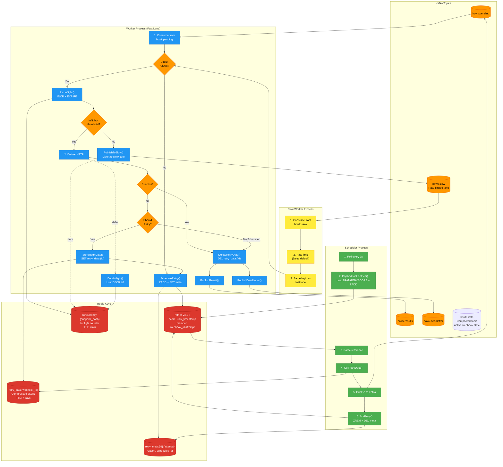

[](https://codecov.io/gh/renatocron/howk)

# HOWK - High Opinionated Webhook Kit

A high-throughput, fault-tolerant webhook delivery system built on Kafka + Redis.

## Philosophy

- **Kafka is the source of truth** — every webhook and delivery result is a Kafka record
- **Redis is rebuildable hot state** — if Redis dies, restore from compacted topic (zero maintenance)
- **Zero maintenance recovery** — distributed lock + canary pattern enables automatic Redis rebuild on multi-instance deployments
- **Last-Write-Wins (LWW)** — nanosecond timestamps prevent race conditions during concurrent reconciliation
- **Circuit breakers protect endpoints** — failing endpoints don't burn your retry budget
- **Penalty box isolates slow endpoints** — excess in-flight traffic is rate-limited to protect the fast lane
- **At-least-once delivery** — we never lose a webhook, duplicates are the receiver's problem

## Architecture

### High-Level Overview

```
                    ┌─────────────────────────────────────┐
                    │           API Gateway               │
                    │  POST /webhooks/:config/enqueue     │
                    │  validate → batch produce           │
                    │  → 202 Accepted                     │
                    └───────────────┬─────────────────────┘
                                    │
                          Kafka Produce (batched)
                                    │
                                    ▼
                 ┌──────────────────────────────────────────┐
                 │            Kafka Cluster                 │
                 │                                          │
                 │  howk.pending    → webhooks to deliver   │
                 │  howk.slow       → rate-limited lane     │
                 │  howk.results    → delivery outcomes     │
                 │  howk.deadletter → exhausted retries     │
                 │                                          │
                 │  retention: 7 days                       │
                 └────┬─────────────────────────┬──────────┘
                      │                         │
            ┌─────────┘                         └──────────┐
            ▼                                              ▼
  ┌──────────────────────┐                    ┌───────────────────────┐
  │   Worker Pool        │                    │   Results Consumer    │
  │   (N consumers)      │                    │                       │
  │                      │                    │   • Update Redis      │
  │   • Read pending     │                    │     status/stats      │
  │   • Check circuit    │                    │   • Feed ClickHouse   │
  │   • Fire HTTP        │                    │     (optional)        │
  │   • Produce result   │                    │                       │
  │   • Schedule retry   │                    └───────────────────────┘
  │     if needed        │
  └──────────┬───────────┘
             │
             ▼
  ┌──────────────────────────────────────────────────────────────────┐
  │                           Redis                                   │
  │                                                                   │
  │  Circuit Breaker (per endpoint):                                  │
  │    HSET circuit:{endpoint_hash} state=OPEN failures=5 last=...   │
  │                                                                   │
  │  Concurrency Control (Penalty Box):                               │
  │    INCR concurrency:{endpoint_hash}  (with TTL)                  │
  │    Lua: DECR with floor at 0 to prevent drift                     │
  │                                                                   │
  │  Retry Scheduling:                                                │
  │    ZADD retries <next_at_unix> <webhook_id:attempt>              │
  │    SET retry_data:{id} <compressed_webhook>                      │
  │                                                                   │
  │  Status (per webhook) - LWW Hash Structure:                       │
  │    HSET status:{webhook_id}                                       │
  │      data={json_blob}     ← WebhookStatus JSON                    │
  │      ts={nanoseconds}     ← UpdatedAtNs for LWW resolution        │
  │    EXPIRE status:{webhook_id} 7d                                  │
  │                                                                   │
  │  Stats (hourly buckets):                                          │
  │    INCR stats:delivered:2026013015                               │
  │    PFADD stats:hll:endpoints:2026013015 {endpoint}               │
  │                                                                   │
  │  System Keys:                                                     │
  │    howk:system:initialized     ← Canary (Redis initialized?)     │
  │    howk:reconciler:lock        ← Distributed lock for rebuild    │
  │                                                                   │
  │  ══════════════════════════════════════════════════════════════  │
  │  ALL OF THIS IS REBUILDABLE FROM KAFKA REPLAY                    │
  └──────────────────────────────────────────────────────────────────┘
```

### System Data Flow



### Retry Lifecycle Sequence


### Redis Key Structure


### Webhook State Machine


### Operations Summary

| Operation | Component | Redis Commands | When Called |
|-----------|-----------|----------------|-------------|
| `IncrInflight()` | Worker | `INCR concurrency:{hash}`<br>`EXPIRE concurrency:{hash} {ttl}` | Before delivery attempt |
| `DecrInflight()` | Worker | `Lua: DECR if > 0` | After delivery (success/fail/DLQ) |
| `PublishToSlow()` | Worker | Kafka Produce to `howk.slow` | When inflight ≥ threshold |
| `StoreRetryData()` | Worker | `SET retry_data:{id} compressed EX 604800` | Before scheduling retry |
| `ScheduleRetry()` | Worker | `ZADD retries score member`<br>`SET retry_meta:{ref}` | After storing data |
| `PopAndLockRetries()` | Scheduler | `Lua: ZRANGEBYSCORE + ZADD future` | Poll loop (every 1s) |
| `GetRetryData()` | Scheduler | `GET retry_data:{id}` | After parsing reference |
| `AckRetry()` | Scheduler | `ZREM retries member`<br>`DEL retry_meta:{ref}` | After Kafka publish |
| `DeleteRetryData()` | Worker | `DEL retry_data:{id}` | Terminal state (success/DLQ) |

## Circuit Breaker Design

Per-endpoint circuit breaker with three states:

```
    ┌─────────────────────────────────────────────────────────────┐
    │                                                             │
    ▼                                                             │
┌────────┐   failure_threshold    ┌────────┐   recovery_timeout  ┌───────────┐
│ CLOSED │ ────────────────────▶  │  OPEN  │ ─────────────────▶  │ HALF_OPEN │
│        │      exceeded          │        │     expired         │           │
└────────┘                        └────────┘                     └───────────┘
    ▲                                  ▲                              │
    │                                  │                              │
    │         success                  │        probe fails           │
    └──────────────────────────────────┴──────────────────────────────┘
                                       │
                                       │ probe succeeds
                                       └────────────────────▶ CLOSED
```

**When circuit is OPEN:**
- Don't attempt delivery (save resources)
- Schedule retry far in the future (respect the endpoint)
- Periodically allow ONE probe request (HALF_OPEN)

**Circuit state is per-endpoint, stored in Redis, rebuildable from Kafka results.**

## Penalty Box / Slow Lane

Prevents slow/timing-out endpoints from starving the fast delivery path by routing excess in-flight traffic to a rate-limited slow topic.

### How It Works

```
Fast Lane (howk.pending)          Slow Lane (howk.slow)
┌─────────────────────┐          ┌─────────────────────┐
│ Consume webhook     │          │ Rate-limited consume│
│ INCR concurrency    │          │ (20/sec per worker) │
│ Check threshold     │          │                     │
│ (< 50 by default)   │          │ Re-check concurrency│
│                     │          │ If recovered → fast │
│ If over threshold ──┼────────►│ If still slow ──────┼──► (backpressure)
│                     │          │                     │
│ HTTP POST           │          │ HTTP POST           │
│ DECR concurrency    │          │ DECR concurrency    │
└─────────────────────┘          └─────────────────────┘
```

**Key behaviors:**

| Component | Failure Mode | Behavior |
|-----------|-------------|----------|
| **Concurrency Check** | Fail-open | If Redis is unavailable, delivery proceeds normally without throttling |
| **Circuit Breaker** | Fail-closed | If Redis is unavailable, requests are blocked (safety over availability) |
| **Idempotency Check** | Fail-open | If Redis is unavailable, duplicate delivery is possible |
| **Slow Lane Divert** | Fail-open | If divert to slow lane fails, delivery proceeds in fast lane |
| **Stats Recording** | Fail-silent | Stats errors are logged but don't block delivery |

- **Fail-open vs Fail-closed**: 
  - **Fail-open** (concurrency, idempotency): Better to deliver duplicates than drop webhooks
  - **Fail-closed** (circuit breaker): Better to pause delivery than overwhelm a failing endpoint
- **Self-healing**: When endpoint recovers, traffic automatically returns to fast lane
- **Crash recovery**: TTL on concurrency keys (2min default) auto-corrects leaked counts
- **Floor protection**: Lua script ensures counter never goes below 0

### Configuration

| Setting | Default | Description |
|---------|---------|-------------|
| `concurrency.max_inflight_per_endpoint` | 50 | Threshold above which webhooks are diverted |
| `concurrency.inflight_ttl` | 2m | TTL for concurrency counter (crash recovery) |
| `concurrency.slow_lane_rate` | 20 | Max deliveries/sec from slow lane per worker |
| `kafka.topics.slow` | howk.slow | Slow lane Kafka topic name |
| `ttl.retry_data_ttl` | 7d | TTL for compressed retry data in Redis |
| `ttl.status_ttl` | 7d | TTL for webhook status records |
| `ttl.circuit_state_ttl` | 24h | TTL for circuit breaker state |
| `ttl.stats_ttl` | 48h | TTL for hourly stats counters |
| `ttl.idempotency_ttl` | 24h | TTL for idempotency keys |

Environment variables:
```bash
export HOWK_CONCURRENCY_MAX_INFLIGHT_PER_ENDPOINT=50
export HOWK_CONCURRENCY_INFLIGHT_TTL=2m
export HOWK_CONCURRENCY_SLOW_LANE_RATE=20
export HOWK_KAFKA_TOPICS_SLOW=howk.slow
export HOWK_TTL_RETRY_DATA_TTL=168h
export HOWK_TTL_STATUS_TTL=168h
export HOWK_TTL_CIRCUIT_STATE_TTL=24h
export HOWK_TTL_STATS_TTL=48h
export HOWK_TTL_IDEMPOTENCY_TTL=24h
```

## Domain Concurrency Limiter (NEW)

Aggregates in-flight requests by domain hostname to prevent overwhelming a single destination, regardless of how many different endpoint URLs point to it.

### Problem It Solves

Without domain limiting:
- `api.stripe.com/hook1` and `api.stripe.com/hook2` have independent inflight budgets
- Could accidentally send 50 + 50 = 100 concurrent requests to `api.stripe.com`
- Stripe (or any destination) may rate-limit or block the traffic

With domain limiting:
- Both endpoints share a per-domain budget (e.g., 100 for `api.stripe.com`)
- Total concurrent requests to stripe.com are capped

### How It Works

```
┌─────────────────────────────────────────────────────────────┐
│  Domain Limiter (Redis-backed)                              │
│                                                             │
│  INCR domain_concurrency:api.stripe.com  ──┐               │
│  (check against max, default: disabled)    │               │
│                                            ▼               │
│  If under limit ──────────────────────────►  Proceed        │
│  If over limit ───────────────────────────►  Divert to slow │
│                                            │               │
│  DECR domain_concurrency:api.stripe.com  ◄──┘  (on complete)│
└─────────────────────────────────────────────────────────────┘
```

**Integration point:** Domain check runs **after** circuit breaker check, **before** endpoint inflight check.

### Configuration

| Setting | Default | Description |
|---------|---------|-------------|
| `concurrency.max_inflight_per_domain` | 0 | Max concurrent requests per domain (0 = disabled) |
| `concurrency.domain_overrides` | {} | Per-domain limits: `{"api.stripe.com": 200}` |

**Environment variables:**
```bash
export HOWK_CONCURRENCY_MAX_INFLIGHT_PER_DOMAIN=100
export HOWK_CONCURRENCY_DOMAIN_OVERRIDES='{"api.stripe.com":200,"hooks.slack.com":30}'
```

**Safety features:**
- **Fail-open**: On Redis error, allows the request (logs warning)
- **TTL**: Uses same TTL as endpoint inflight counters (2min default)
- **Lua DECR**: Never goes below zero (prevents counter drift)

## Per-Key Parallelism (NEW)

Controls how many goroutines process messages for the same partition key (ConfigID) concurrently. 

### Trade-off

| Value | Behavior | Use Case |
|-------|----------|----------|
| 1 (default) | Sequential per ConfigID | Need strict ordering per tenant |
| N > 1 | Parallel per ConfigID | Maximize throughput, idempotent webhooks |

### Configuration

```yaml
kafka:
  per_key_parallelism: 1  # Default: sequential
```

**Environment variable:**
```bash
export HOWK_KAFKA_PER_KEY_PARALLELISM=4
```

**Important:** With N > 1, messages from the same ConfigID may be delivered concurrently/out of order. This is safe if webhooks are idempotent (each has unique ID, receivers should handle duplicates).

## Retry Strategy

Exponential backoff with circuit-aware delays:

```
Base delay: 10s
Max delay: 24h
Max attempts: 20
Jitter: ±20%

Circuit CLOSED:  delay = base * (2 ^ min(attempt, 10)) + jitter
Circuit OPEN:    delay = recovery_timeout (e.g., 5 minutes)
Circuit HALF_OPEN: immediate (it's a probe)
```

## Components

| Binary | Purpose |
|--------|---------|
| `howk-api` | HTTP API for enqueueing webhooks |
| `howk-worker` | Consumes pending, delivers, produces results. Includes both fast lane and slow lane workers |
| `howk-scheduler` | Pops due retries from Redis, re-enqueues to Kafka |
| `howk-reconciler` | Rebuilds Redis state from Kafka replay |

## Quick Start

```bash
# Start infrastructure
docker-compose up -d

# Run all components
make run-api
make run-worker
make run-scheduler

# Enqueue a webhook
curl -X POST http://localhost:8080/webhooks/tenant123/enqueue \
  -H "Content-Type: application/json" \
  -d '{
    "endpoint": "https://example.com/webhook",
    "payload": {"event": "user.created", "data": {"id": 123}},
    "idempotency_key": "user-created-123"
  }'
```

## Configuration

HOWK supports flexible configuration through:

1. **Environment Variables** (highest priority) - `HOWK_*` prefixed
2. **Config File** (YAML format) - specified via `--config` flag or auto-discovered
3. **Defaults** (lowest priority) - sensible built-in defaults

### Environment Variables

Override any configuration setting using environment variables with the `HOWK_` prefix:

```bash
export HOWK_API_PORT=9090
export HOWK_KAFKA_BROKERS=kafka1:9092,kafka2:9092
export HOWK_REDIS_ADDR=redis.example.com:6379
export HOWK_REDIS_PASSWORD=secret
export HOWK_TTL_STATUS_TTL=72h
bin/howk-api
```

See `.env.example` for a complete list of environment variables.

### Config File

Use a YAML config file for complex configurations:

```bash
bin/howk-api --config=/etc/howk/config.yaml
```

Example `config.yaml`:

```yaml
api:
  port: 8080
  read_timeout: 10s
  write_timeout: 10s

kafka:
  brokers:
    - localhost:19092
  topics:
    pending: howk.pending
    slow: howk.slow
    results: howk.results
    deadletter: howk.deadletter
  consumer_group: howk-workers
  retention: 168h
  # per_key_parallelism: 1  # Uncomment for per-key parallelism (default: 1 = sequential)

redis:
  addr: "localhost:6379"
  password: ""
  pool_size: 100

delivery:
  timeout: 30s
  max_idle_conns: 100
  max_conns_per_host: 10

retry:
  base_delay: 10s
  max_delay: 24h
  max_attempts: 20
  jitter: 0.2

circuit_breaker:
  failure_threshold: 5
  failure_window: 60s
  recovery_timeout: 5m
  probe_interval: 60s
  success_threshold: 2

concurrency:
  max_inflight_per_endpoint: 50
  inflight_ttl: 2m
  slow_lane_rate: 20
  # max_inflight_per_domain: 0  # Uncomment to enable domain limiting (0 = disabled)
  # domain_overrides:           # Optional per-domain limits
  #   api.stripe.com: 200
  #   hooks.slack.com: 30

scheduler:
  poll_interval: 1s
  batch_size: 500

ttl:
  circuit_state_ttl: 24h
  status_ttl: 168h
  stats_ttl: 48h
  idempotency_ttl: 24h
  retry_data_ttl: 168h  # Compressed webhook data for retries
```

### Configuration Precedence

Environment variables override config file settings, which override defaults:

```bash
# config.yaml has: api.port: 7070
# Environment variable overrides it:
export HOWK_API_PORT=9090
bin/howk-api --config=config.yaml
# Result: API listens on port 9090
```

## API

### Enqueue Webhook

```
POST /webhooks/:config/enqueue
```

Request:
```json
{
  "endpoint": "https://customer.com/webhook",
  "payload": {"event": "order.completed"},
  "headers": {"X-Custom": "value"},
  "idempotency_key": "order-123-completed",
  "signing_secret": "whsec_..."
}
```

Response: `202 Accepted`
```json
{
  "webhook_id": "wh_01HQXYZ...",
  "status": "pending"
}
```

### Get Status

```
GET /webhooks/:webhook_id/status
```

Response:
```json
{
  "webhook_id": "wh_01HQXYZ...",
  "state": "delivered",
  "attempts": 2,
  "last_attempt_at": "2026-01-30T10:00:00Z",
  "last_status_code": 200,
  "next_retry_at": null
}
```

### Get Stats

```
GET /stats
```

Response:
```json
{
  "last_1h": {
    "enqueued": 7200,
    "delivered": 7150,
    "failed": 50,
    "unique_endpoints": 1200
  },
  "last_24h": {
    "enqueued": 172800,
    "delivered": 170000,
    "failed": 2800,
    "unique_endpoints": 45000
  }
}
```

### Incoming Webhook Transformer

```
POST /incoming/:script_name
```

Execute a Lua transformer script to fan out incoming webhooks. See [docs/transformers.md](docs/transformers.md) for full documentation.

Request:
```bash
curl -X POST http://localhost:8080/incoming/stripe-router \
  -H "Content-Type: application/json" \
  -u admin:password \
  -d '{"type": "charge.succeeded", "amount": 1000}'
```

Response: `200 OK`
```json
{
  "webhooks": [
    {"id": "wh_01HQXYZ...", "endpoint": "https://billing.internal/webhook"},
    {"id": "wh_01HQABC...", "endpoint": "https://analytics.internal/track"}
  ],
  "count": 2
}
```

**Features:**
- Lua scripting for payload transformation and routing
- Fan-out: 1 incoming request → N outgoing webhooks
- Basic Auth support (bcrypt or plaintext)
- Domain allowlists for security
- Hot-reload via SIGHUP
- KV store access for deduplication/state
- HTTP client for external API calls

## Recovery

### Redis Dies (Zero Maintenance Recovery)

HOWK implements **automatic self-healing** for Redis loss using a distributed coordination pattern:

#### Automatic Recovery (Multi-Instance)

When Redis is lost in a multi-instance deployment (e.g., 3 workers + 2 publishers):

```
┌─────────────┐     ┌─────────────┐     ┌─────────────┐
│   Worker    │     │   Worker    │     │   Worker    │
│  Instance 1 │     │  Instance 2 │     │  Instance N │
└──────┬──────┘     └──────┬──────┘     └──────┬──────┘
       │                   │                   │
       └─────────┬─────────┴─────────┬─────────┘
                 ▼                   ▼
       ┌───────────────────────────────────────┐
       │         Distributed Lock              │
       │   SET howk:reconciler:lock NX EX 60   │
       │   (Only 1 instance wins)              │
       └───────────────┬───────────────────────┘
                       ▼
       ┌───────────────────────────────────────┐
       │         Reconciler (Winner)           │
       │   1. Flush Redis                      │
       │   2. Consume howk.state → HWM         │
       │   3. Restore status + retries         │
       │   4. SET howk:system:initialized      │
       └───────────────┬───────────────────────┘
                       ▼
       ┌───────────────────────────────────────┐
       │        All Other Instances            │
       │   WaitForCanary() then resume         │
       └───────────────────────────────────────┘
```

**Startup Sequence (Per Instance):**
1. Check `howk:system:initialized` canary key
2. If missing: try to acquire `howk:reconciler:lock`
3. If lock acquired: run reconciler, set canary, release lock
4. If lock NOT acquired: `WaitForCanary()` until peer finishes
5. Proceed with normal operation

**Runtime Sentinel (Auto-Recovery):**
- Background goroutine checks canary every 30s
- If canary missing (Redis flushed/lost):
  - Pause Kafka consumer
  - Try to acquire lock → reconcile → set canary
  - Resume consumer

#### Last-Write-Wins (LWW) Conflict Resolution

To prevent race conditions during concurrent reconciliation:

```lua
-- Every SetStatus uses Lua script with nanosecond timestamp check
local old_ts = tonumber(redis.call('HGET', KEYS[1], 'ts') or '0')
if new_ts > old_ts then
    redis.call('HSET', key, 'data', data, 'ts', new_ts)
    return 1  -- updated
end
return 0  -- skipped (old data)
```

- **Workers** set `UpdatedAtNs = time.Now().UnixNano()` on every status change
- **Reconciler** restores timestamps from Kafka snapshots
- **Result:** Even if reconciler replays stale data, it won't overwrite newer writes

#### Manual Recovery (Optional)

For single-instance deployments or forced rebuild:

```bash
# Stop workers, flush Redis, run reconciler, start workers
redis-cli FLUSHDB
./bin/howk-reconciler
./bin/howk-worker &
```

**Why this works:**
- Workers continuously publish state snapshots to `howk.state` topic
- Failed webhooks (pending retry) → full state snapshot with `UpdatedAtNs`
- Terminal webhooks (delivered/exhausted) → tombstone published
- Kafka compaction retains only the latest state per webhook
- LWW ensures safe concurrent writes during recovery

**No data loss:** Redis state is fully reconstructible from Kafka's compacted topic.

### Kafka Broker Dies

Kafka handles this internally via replication. If you lose all replicas... you have bigger problems.

## License

MIT
