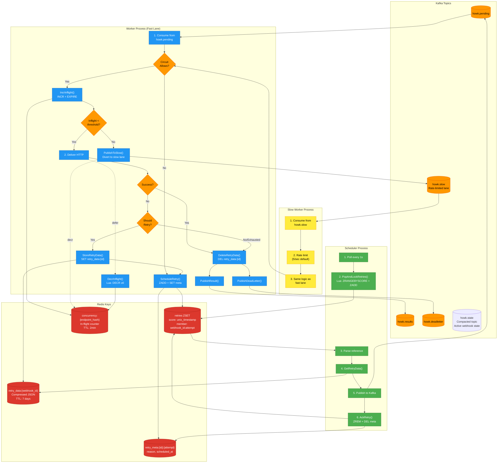
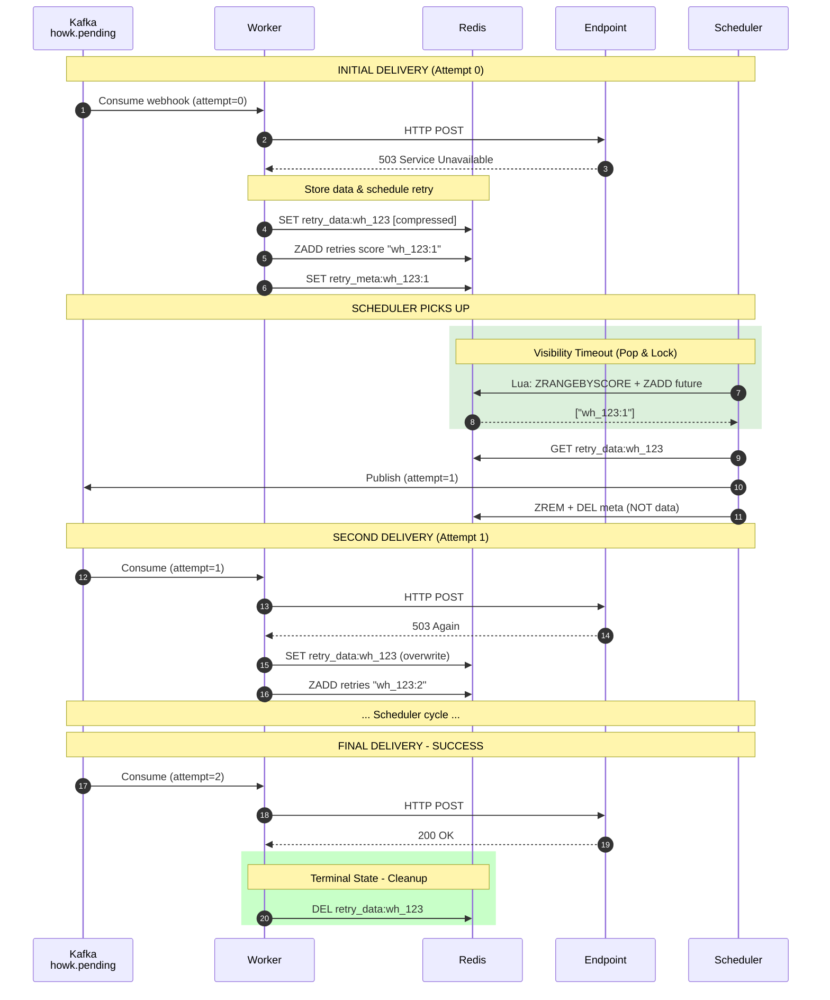
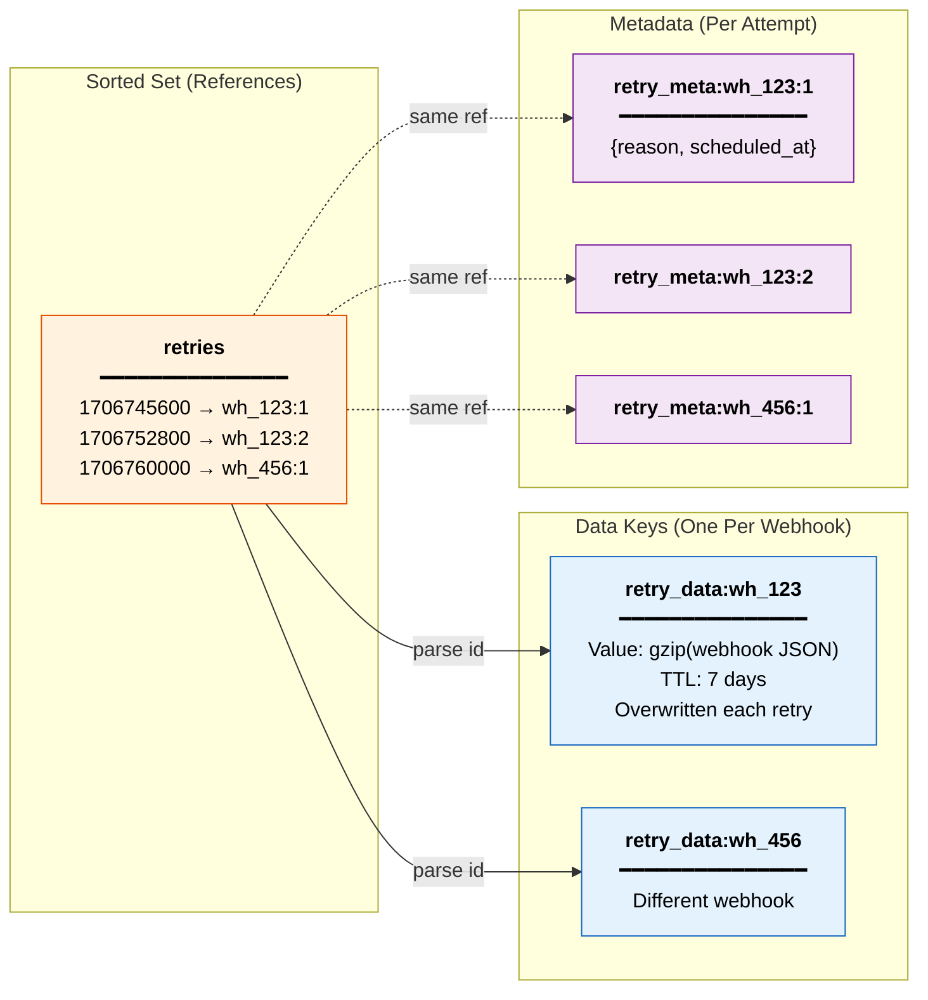
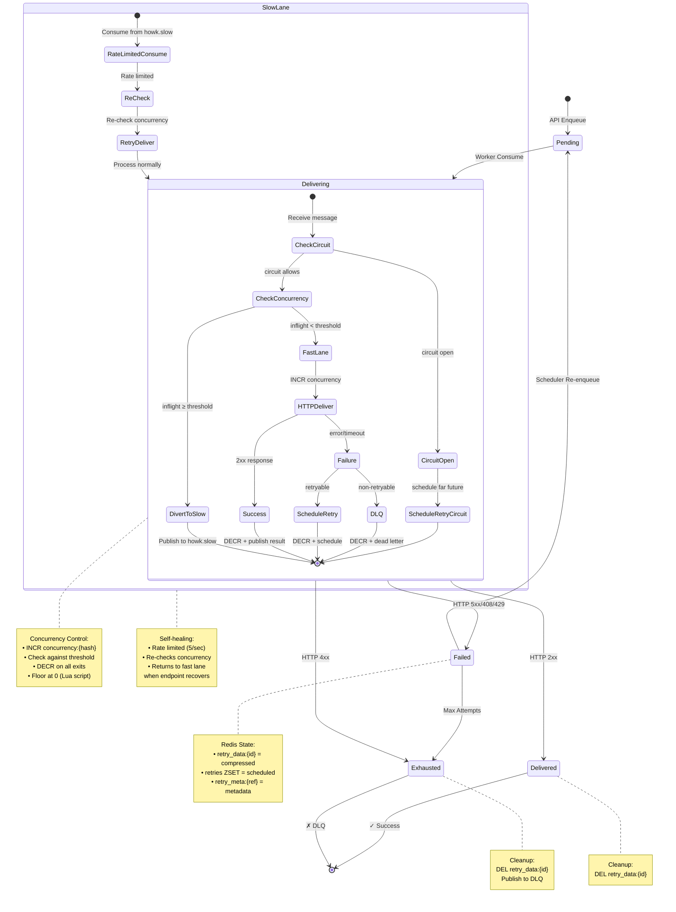

# HOWK — Architecture Reference

Detailed flow diagrams that don't fit comfortably in the README. For a high-level
component overview, see the README. For failure scenarios, see
[FAILURE_MODES.md](./FAILURE_MODES.md).

## System Data Flow

End-to-end view of how a webhook moves through the system, including the fast
lane, slow lane, retry path, and the Redis keys touched at each step.

## Retry Lifecycle Sequence

## Redis Key Structure

## Webhook State Machine

## Operations Summary

| Operation | Component | Redis Commands | When Called |
|-----------|-----------|----------------|-------------|
| `IncrInflight()` | Worker | `INCR concurrency:{hash}` `EXPIRE concurrency:{hash} {ttl}` | Before delivery attempt |
| `DecrInflight()` | Worker | `Lua: DECR if > 0` | After delivery (success/fail/DLQ) |
| `PublishToSlow()` | Worker | Kafka Produce to `howk.slow` | When inflight ≥ threshold |
| `StoreRetryData()` | Worker | `SET retry_data:{id} compressed EX 604800` | Before scheduling retry |
| `ScheduleRetry()` | Worker | `ZADD retries score member` `SET retry_meta:{ref}` | After storing data |
| `PopAndLockRetries()` | Scheduler | `Lua: ZRANGEBYSCORE + ZADD future` | Poll loop (every 1s) |
| `GetRetryData()` | Scheduler | `GET retry_data:{id}` | After parsing reference |
| `AckRetry()` | Scheduler | `ZREM retries member` `DEL retry_meta:{ref}` | After Kafka publish |
| `DeleteRetryData()` | Worker | `DEL retry_data:{id}` | Terminal state (success/DLQ) |
